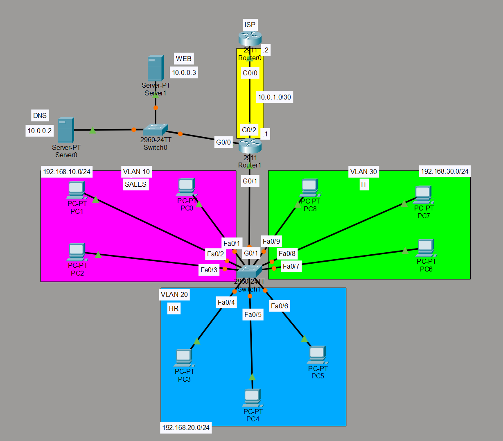
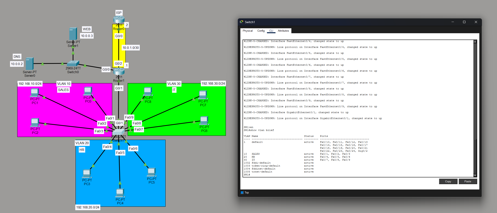
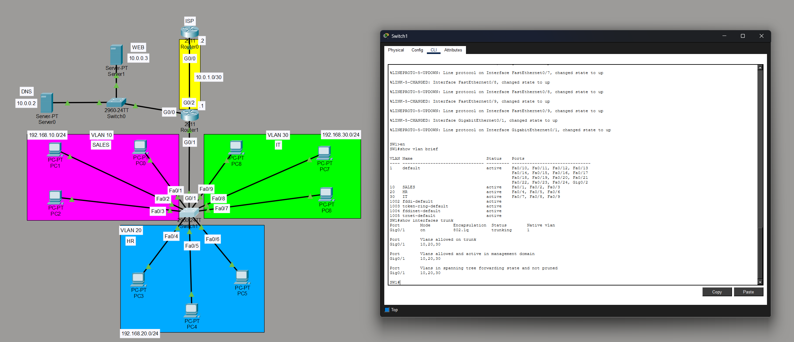
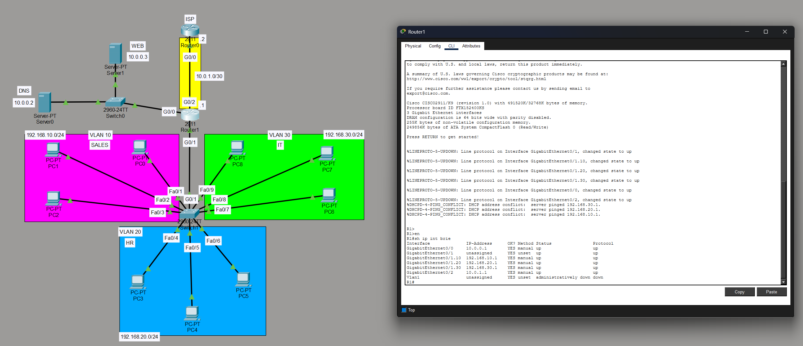
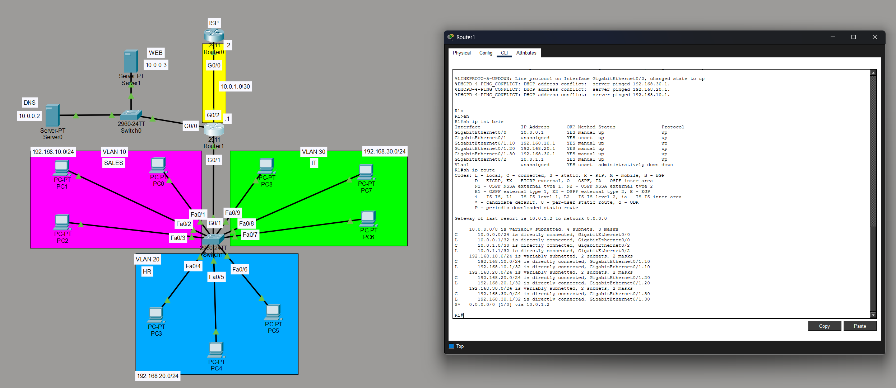
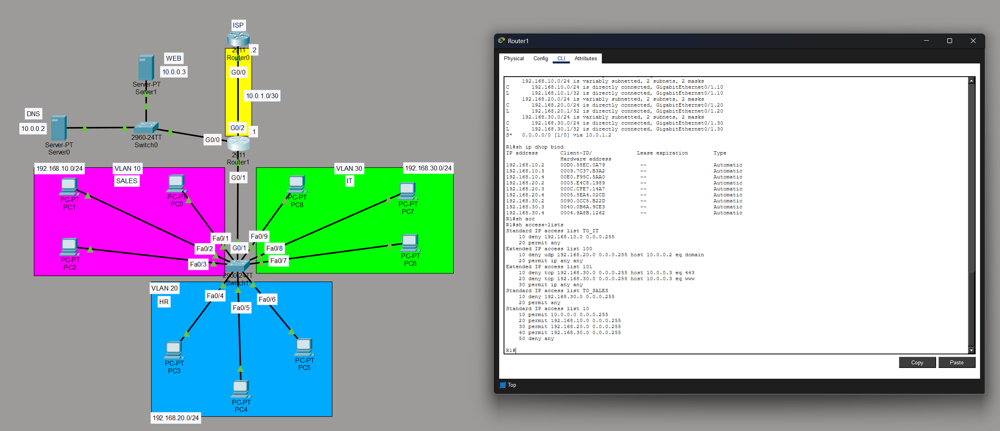
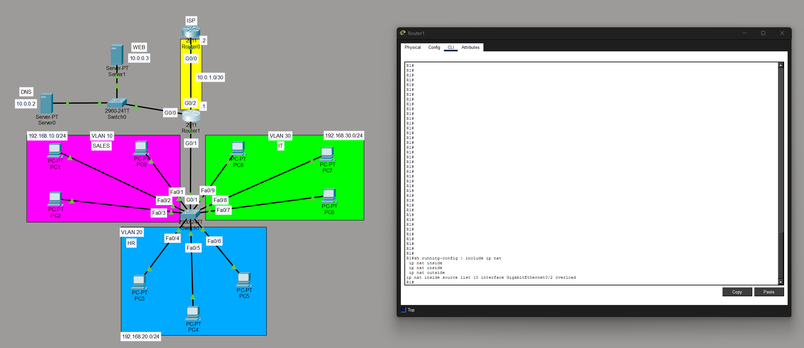
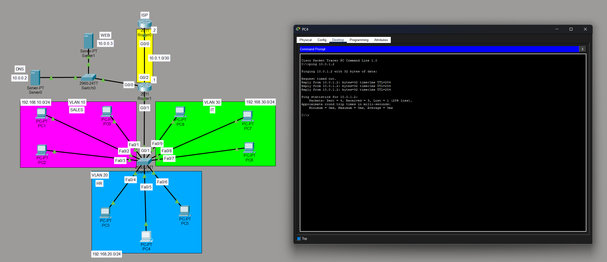
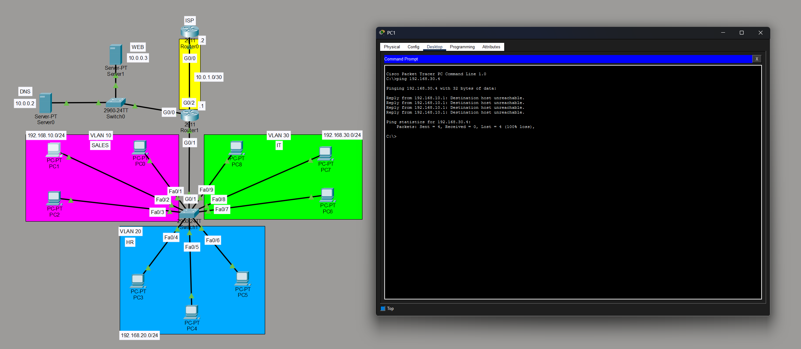
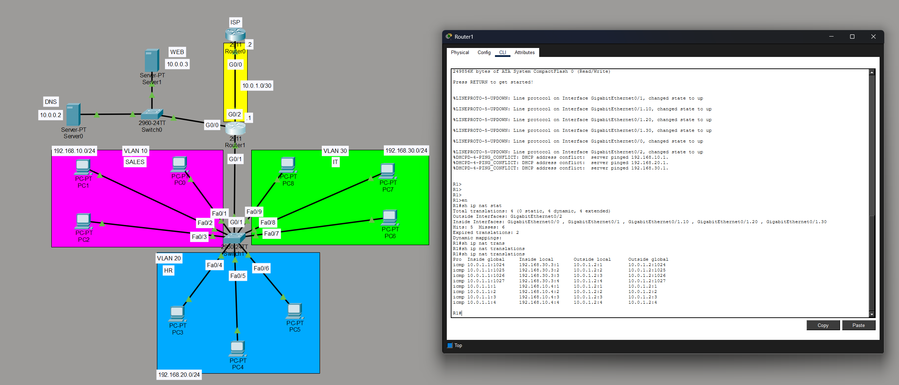

# Cisco Enterprise Network Simulation (Packet Tracer)



## Overview

This project is a Cisco Packet Tracer enterprise network simulation demonstrating core networking technologies used in real-world enterprise environments.

The lab includes VLAN segmentation, router-on-a-stick inter-VLAN routing, DHCP services, ACL security policies, NAT overload (PAT), and simulated ISP connectivity.

This project demonstrates practical networking skills applicable to NOC Technician, Network Support, and Help Desk roles.

---

# Network Architecture

The network is segmented into multiple departments using VLANs.

| VLAN | Department | Network |
|-----|------|------|
| VLAN 10 | Sales | 192.168.10.0/24 |
| VLAN 20 | HR | 192.168.20.0/24 |
| VLAN 30 | IT | 192.168.30.0/24 |

Infrastructure components:

- DNS Server → `10.0.0.2`
- Web Server → `10.0.0.3`
- ISP connection → `10.0.1.0/30`
- Router-on-a-stick inter-VLAN routing

---

# Technologies Implemented

This lab demonstrates the following networking technologies:

- VLAN configuration
- Access port assignments
- 802.1Q trunking
- Router-on-a-stick inter-VLAN routing
- DHCP configuration
- Standard ACLs
- Extended ACLs
- NAT overload (PAT)
- Static default routing
- Network verification and troubleshooting

---

# VLAN Configuration



VLANs were created on the switch to logically separate network departments.

Access ports were assigned to the correct VLAN to isolate traffic between departments.

---

# Trunk Configuration



A trunk link was configured between the switch and router using 802.1Q encapsulation.

Allowed VLANs on the trunk:

- VLAN 10
- VLAN 20
- VLAN 30

---

# Router-on-a-Stick Configuration



Inter-VLAN routing was implemented using router subinterfaces.

Each VLAN has its own gateway interface on the router.

Example:

- G0/1.10 → 192.168.10.1
- G0/1.20 → 192.168.20.1
- G0/1.30 → 192.168.30.1

---

# Routing Table Verification



The router routing table confirms:

- Directly connected VLAN networks
- Default route pointing to the ISP router

---

# Access Control Lists (ACL)



ACLs were configured to enforce security policies between VLANs and control traffic to internal resources.

Examples include:

- Blocking certain department communication
- Controlling access to internal servers

---

# NAT Overload (PAT)



NAT overload was implemented to allow internal private networks to access the simulated ISP using a single public IP address.

Configuration includes:

- `ip nat inside`
- `ip nat outside`
- `ip nat inside source list 10 interface GigabitEthernet0/2 overload`

---

# Connectivity Verification



Hosts inside the network can successfully reach the ISP router demonstrating:

- Proper routing
- Working NAT translation
- End-to-end connectivity

---

# ACL Security Verification



This test demonstrates the ACL rules are functioning properly by blocking restricted traffic between VLANs.

---

# NAT Translation Table



The NAT translation table confirms active PAT translations between internal private addresses and the external interface.

---

# Skills Demonstrated

This project demonstrates hands-on experience with:

- Layer 2 switching
- VLAN segmentation
- trunking
- inter-VLAN routing
- DHCP services
- ACL security policies
- NAT overload
- static routing
- network verification and troubleshooting

---

# Files Included

```
enterprise-network-simulation-packet-tracer
│
├── README.md
├── packet-tracer-lab.pkt
└── screenshots
```

---

# Author

Ibrahim Atoum
Cybersecurity Student | CompTIA A+ | Network+ | Security+ | CCNA
